<h1 align="center">Hi 👋, I'm Mohit Sahani</h1>

<h3 align="center">
Full-Stack Developer • AI/GenAI Engineer • Backend Developer
</h3>

<p align="center">
  I build AI-powered products, scalable backend systems, and modern full-stack applications.
</p>

<p align="center">
  🇮🇳 India &nbsp;•&nbsp; 🎓 B.Tech CSE &nbsp;•&nbsp; 🚀 Builder &nbsp;•&nbsp; 🤖 AI Enthusiast
</p>

<p align="center">
  <a href="https://github.com/Sagolsa78">
    
  </a>
  <a href="https://www.linkedin.com/in/sahani78">
    
  </a>
  <a href="https://sagolsa78.vercel.app">
    
  </a>
  <a href="mailto:sahanimohit5ed@gmail.com">
    
  </a>
</p>

---


## 👨‍💻 About Me

I'm a **Full-Stack Developer focused on AI-powered applications and backend engineering**.

I enjoy taking an idea from:

**Concept → Architecture → Development → AI Integration → Deployment**

My main interests are:

* 🤖 Generative AI & LLM applications
* 🧠 AI automation and intelligent workflows
* ⚙️ Backend APIs and distributed systems
* 🌐 Full-stack web development
* ☁️ Cloud-native application architecture
* 🎬 AI-powered content generation
* 🗄️ Databases, caching, queues & object storage

I care about building systems that go beyond demos and can be **deployed, operated and extended like real products**.

<br clear="right"/>

---

# 🚀 Featured Project

<a href="https://github.com/Sagolsa78/AutoTube_AI">

## 🎬 AutoTube AI

</a>

> **AI-powered video generation and automation platform**

AutoTube AI is my current major project focused on building an end-to-end system that can transform a content brief into a generated video through an automated production pipeline.

### ⚡ Architecture

```text
User
 │
 ▼
React / Vite Frontend
 │
 ▼
FastAPI Backend
 │
 ├── PostgreSQL
 ├── Redis
 ├── Object Storage
 └── AI / LLM Services
          │
          ▼
   Video Generation Pipeline
          │
          ▼
      Render Worker
          │
          ▼
      Final Video
```

### 🔧 Key Areas

`FastAPI` `React` `TypeScript` `PostgreSQL` `Redis` `Docker`

`LLMs` `AI Generation` `Cloudflare R2 / S3` `GitHub Actions`

### ✨ Features

* 📝 AI-assisted script generation
* 🎞️ Storyboard-based video pipeline
* 🎨 Multiple visual generation modes
* 🤖 LLM-powered workflows
* ⚙️ Background rendering architecture
* ☁️ S3-compatible object storage
* 🔐 User isolation and multi-tenancy
* 🐳 Dockerized development environment
* 📱 PWA support
* 🌎 Multilingual workflow
* 💻 Local + Cloud execution architecture

<a href="https://github.com/Sagolsa78/AutoTube_AI">
  
</a>

---

# 🧩 Other Things I've Built

### 🧾 AI Billing & ERP

A modern billing/ERP platform exploring AI-assisted invoice processing, OCR, GST workflows, inventory and offline-first architecture.

**Stack:** `React` `Node.js` `MongoDB` `FastAPI` `OCR` `LLMs`

---

### 🏠 BhuExpert

Real-estate property search and SaaS platform developed around modern full-stack and AI workflows.

**Stack:** `React` `TypeScript` `Next.js` `Node.js` `AI`

---


# 🛠️ Tech Stack

### Languages

<p align="left">


</p>

`FastAPI` `REST APIs` `JWT` `Socket.IO` `WebSockets`

### AI / GenAI

`LLMs` `Generative AI` `Hugging Face` `Ollama` `OpenRouter`

`LangChain` `PaddleOCR` `OpenCV` `MediaPipe`

### Databases & Infrastructure

<p align="left">


</p>

`Cloudflare R2` `Amazon S3` `GitHub Actions` `Docker Compose`

---

# 📊 GitHub Statistics

<div align="center">





</div>

<p align="center">
  <sub>Automatically updated through GitHub Actions.</sub>
</p>

---


# 🌐 Connect With Me

<p align="center">

<a href="https://www.linkedin.com/in/sahani78">

</a>

<a href="https://github.com/Sagolsa78">

</a>

<a href="https://sagolsa78.vercel.app">

</a>

<a href="https://x.com/Sagolsa78">

</a>

<a href="mailto:sahanimohit5ed@gmail.com">

</a>

</p>

---

# 🐍 Contribution Snake

<div align="center">


</div>

---

<div align="center">

### 💻 Build. Break. Learn. Ship. Repeat. 🚀

</div>
